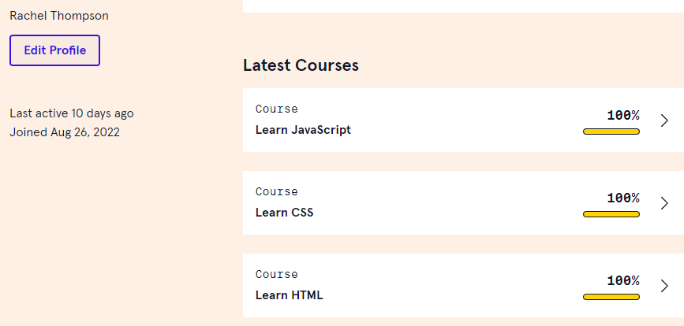

# Hi, :👋 My name is Rachel Thompson

## I am a CIS major

- 🌎 I'm based in Sheffield, Alabama
- 📧 You can contact me at rt0450699@gmail.com
- 💻 I'm in my senior year at University of North Alabama

 ### Certifications
 - Certified Microsoft Office Specialist, Word 2013
 - Certified Microsoft Office Specialist, PowerPoint 2013

### Skills 

      

### CodeCademy Courses

### Projects
- Alpha https://codepen.io/panhead63/full/abPbOOg
- Charlie https://panhead63.github.io/probable-octo-engine-charlie/
- Delta https://panhead63.github.io/friendly-octo-guide-delta/
- Echo https://panhead63.github.io/friendly-octo-guide-delta/

### Socials

   

